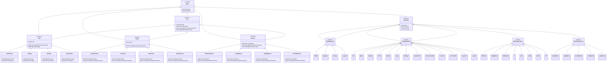

# 表达式语法类图

```mermaid
classDiagram
    class Node {
        <<interface>>
        +Lexical lexical()
        +String toString()
    }
    
    class Var {
        <<interface>>
        +Lexical lexical()
        +ValueType valueType()
        +Value execute(ParamCollection param)
        +void usedArg(Set~String~ args)
    }
    
    class Operators {
        <<abstract>>
        +int priority()
        +String symbol()
        +Lexical lexical()
    }
    
    class Arg {
        <<abstract>>
        +String code
        +Value execute(ParamCollection param)
        +ValueType valueType()
    }
    
    class Const {
        <<abstract>>
        +Value value
        +Value execute(ParamCollection param)
    }
    
    class Express {
        <<interface>>
        +ValueType valueType()
        +Value execute(ParamCollection param)
        +void usedArg(Set~String~ args)
    }
    
    Node <|-- Var
    Node <|-- Operators
    Node <|-- Const
    Node <|-- Arg
    Node <|-- Express
    
    Var <|-- Arg
    Var <|-- Const
    Var <|-- Express
    
    Operators <|-- SingleOperator
    Operators <|-- DoubleOperator
    Operators <|-- MethodOperators
    Operators <|-- WindowOperators
    
    Arg <|-- NumberArg
    Arg <|-- TextArg
    Arg <|-- DateArg
    Arg <|-- BooleanArg
    
    Const <|-- NumberConst
    Const <|-- TextConst
    Const <|-- DateConst
    Const <|-- BooleanConst
    
    Express <|-- BrokersExpress
    Express <|-- CaseExpress
    Express <|-- SingleExpress
    Express <|-- CommaExpress
    
    class SingleOperator {
        <<abstract>>
    }
    class DoubleOperator {
        <<abstract>>
    }
    class MethodOperators {
        <<abstract>>
    }
    class WindowOperators {
        <<abstract>>
    }
    
    Operators <|-- SingleOperator
    Operators <|-- DoubleOperator
    
    class NumberArg {
        +NumberArg(String code)
        +ValueType valueType()
    }
    class TextArg {
        +TextArg(String code)
        +ValueType valueType()
    }
    class DateArg {
        +DateArg(String code)
        +ValueType valueType()
    }
    class BooleanArg {
        +BooleanArg(String code)
        +ValueType valueType()
    }
    
    class NumberConst {
        +NumberConst(String value)
        +Value execute(ParamCollection param)
    }
    class TextConst {
        +TextConst(String value)
        +Value execute(ParamCollection param)
    }
    class DateConst {
        +DateConst(String value)
        +Value execute(ParamCollection param)
    }
    class BooleanConst {
        +BooleanConst(String value)
        +Value execute(ParamCollection param)
    }
    
    class BrokersExpress {
        +ValueType valueType()
        +Value execute(ParamCollection param)
    }
    class CaseExpress {
        +ValueType valueType()
        +Value execute(ParamCollection param)
    }
    class SingleExpress {
        +ValueType valueType()
        +Value execute(ParamCollection param)
    }
    class CommaExpress {
        +ValueType valueType()
        +Value execute(ParamCollection param)
    }
    
    SingleOperator <|-- BitNot
    SingleOperator <|-- Negative
    SingleOperator <|-- Positive
    SingleOperator <|-- LogicNot
    
    DoubleOperator <|-- Plus
    DoubleOperator <|-- Minus
    DoubleOperator <|-- Multiply
    DoubleOperator <|-- Divide
    DoubleOperator <|-- Modulo
    DoubleOperator <|-- Equal
    DoubleOperator <|-- NotEqual
    DoubleOperator <|-- GreaterThan
    DoubleOperator <|-- GreaterThanOE
    DoubleOperator <|-- LessThan
    DoubleOperator <|-- LessThanOE
    DoubleOperator <|-- LogicAnd
    DoubleOperator <|-- LogicOr
    
    MethodOperators <|-- IfMethod
    MethodOperators <|-- MaxMethod
    MethodOperators <|-- MinMethod
    MethodOperators <|-- In
    MethodOperators <|-- NotIn
    MethodOperators <|-- IsNull
    MethodOperators <|-- Switch
    MethodOperators <|-- IFF
    
    WindowOperators <|-- SumMethod
    WindowOperators <|-- AvgMethod
    WindowOperators <|-- CountMethod
    WindowOperators <|-- FirstMethod
    WindowOperators <|-- LastMethod
```