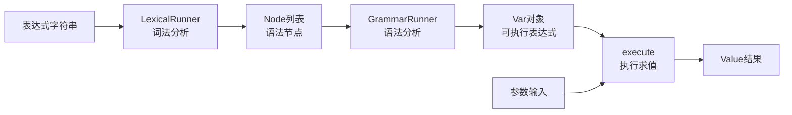
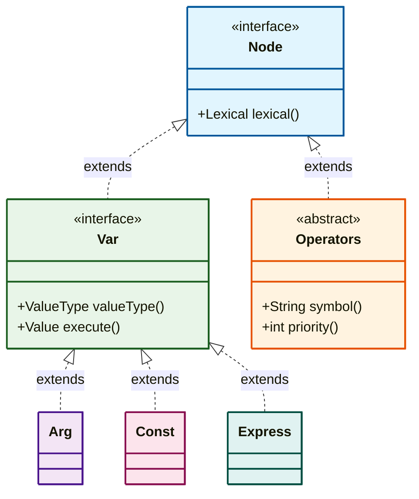

# 表达式语法类图（优化版）

## 核心节点结构

```mermaid
graph TB
    subgraph "Node接口层"
        A[Node<br/>接口] --> B[Var接口]
        A --> C[Operators<br/>抽象类]
        A --> D[Const<br/>抽象类]
        A --> E[Arg<br/>抽象类]
        A --> F[Express<br/>接口]
    end
    
    subgraph "Var实现层"
        B --> G[Arg实现类]
        B --> H[Const实现类]
        B --> I[Express实现类]
    end
    
    subgraph "Operators子类层"
        C --> J[SingleOperator<br/>单目操作符]
        C --> K[DoubleOperator<br/>双目操作符]
        C --> L[MethodOperators<br/>方法操作符]
        C --> M[WindowOperators<br/>窗口操作符]
    end
    
    subgraph "具体操作符类"
        J --> J1[BitNot 按位取反]
        J --> J2[Negative 负号]
        J --> J3[Positive 正号]
        J --> J4[LogicNot 逻辑非]
        
        K --> K1[Plus 加法]
        K --> K2[Minus 减法]
        K --> K3[Multiply 乘法]
        K --> K4[Divide 除法]
        K --> K5[Equal 相等]
        K --> K6[NotEqual 不等]
        K --> K7[GreaterThan 大于]
        K --> K8[LessThan 小于]
        K --> K9[LogicAnd 逻辑与]
        K --> K10[LogicOr 逻辑或]
        
        L --> L1[IfMethod IF函数]
        L --> L2[MaxMethod MAX函数]
        L --> L3[MinMethod MIN函数]
        L --> L4[In IN函数]
        L --> L5[NotIn NOT_IN函数]
        L --> L6[IsNull ISNULL函数]
        L --> L7[Switch SWITCH函数]
        L --> L8[IFF IFF函数]
        
        M --> M1[SumMethod SUM函数]
        M --> M2[AvgMethod AVG函数]
        M --> M3[CountMethod COUNT函数]
    end
    
    subgraph "参数类"
        G --> G1[NumberArg 数值参数]
        G --> G2[TextArg 文本参数]
        G --> G3[DateArg 日期参数]
        G --> G4[BooleanArg 布尔参数]
    end
    
    subgraph "常量类"
        H --> H1[NumberConst 数值常量]
        H --> H2[TextConst 文本常量]
        H --> H3[DateConst 日期常量]
        H --> H4[BooleanConst 布尔常量]
    end
    
    subgraph "表达式类"
        I --> I1[BrokersExpress 代理表达式]
        I --> I2[CaseExpress Case表达式]
        I --> I3[SingleExpress 单目表达式]
        I --> I4[CommaExpress 逗号表达式]
    end
    
    %% 样式定义
    classDef interfaceClass fill:#e1f5fe,stroke:#01579b,stroke-width:2px,color:#000
    classDef abstractClass fill:#fff3e0,stroke:#e65100,stroke-width:2px,color:#000
    classDef concreteClass fill:#f3e5f5,stroke:#4a148c,stroke-width:2px,color:#000
    classDef implClass fill:#e8f5e8,stroke:#1b5e20,stroke-width:2px,color:#000
    
    class A interfaceClass
    class B,C,D,E,F,G,H,I,J,K,L,M abstractClass
    class J1,J2,J3,J4,K1,K2,K3,K4,K5,K6,K7,K8,K9,K10,L1,L2,L3,L4,L5,L6,L7,L8,M1,M2,M3,G1,G2,G3,G4,H1,H2,H3,H4,I1,I2,I3,I4 concreteClass
```

## 表达式执行流程

```mermaid
flowchart LR
    A[表达式字符串] --> B[LexicalRunner<br/>词法分析]
    B --> C[Node列表<br/>语法节点]
    C --> D[GrammarRunner<br/>语法分析]
    D --> E[Var对象<br/>可执行表达式]
    E --> F[execute<br/>执行求值]
    F --> G[Value结果]
    
    H[参数输入] --> F
```

## 继承关系详解

```mermaid
classDiagram
    class Node {
        <<interface>>
        +Lexical lexical()
    }
    
    class Var {
        <<interface>>
        +ValueType valueType()
        +Value execute()
    }
    
    class Operators {
        <<abstract>>
        +String symbol()
        +int priority()
    }
    
    Node <|.. Var : extends
    Node <|.. Operators : extends
    Var <|.. Arg : extends
    Var <|.. Const : extends
    Var <|.. Express : extends
    
    style Node fill:#e1f5fe,stroke:#01579b,stroke-width:2px
    style Var fill:#e8f5e8,stroke:#1b5e20,stroke-width:2px
    style Operators fill:#fff3e0,stroke:#e65100,stroke-width:2px
    style Arg fill:#f3e5f5,stroke:#4a148c,stroke-width:2px
    style Const fill:#fce4ec,stroke:#880e4f,stroke-width:2px
    style Express fill:#e0f2f1,stroke:#004d40,stroke-width:2px
```